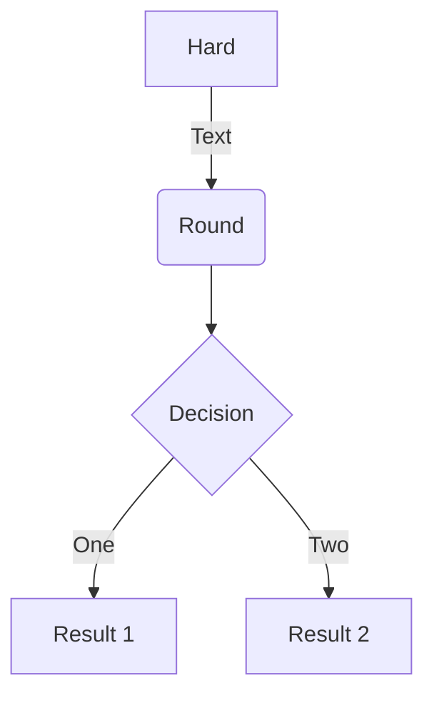

### Button

If we want to quote another post, we can use a button.

 


### Mermaid

Visit https://github.com/mermaid-js/mermaid to check the usage.





<!-- tab Solution 1 -->
**This is Tab 1.**
```java
public class Tab1 {

}
```
<!-- endtab -->

<!-- tab Test 2 -->
**This is Tab 2.**
```java
public class Tab2 {
    
}
```
<!-- endtab -->

<!-- tab -->
**This is Tab 3.**
```java
public class Tab3 {
    
}
```
<!-- endtab -->

<!-- tab -->
**This is Tab 4.**
```java
public class Tab4 {
    
}
```
<!-- endtab -->



### Math Equations

Check for math equations: https://theme-next.js.org/docs/third-party-services/math-equations

Test the math equations:
$$\begin{equation} \label{eq1}
e=mc^2
\end{equation}$$

